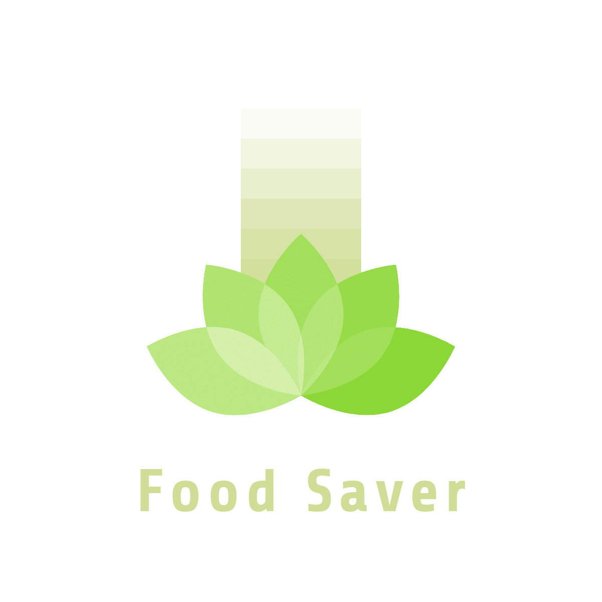
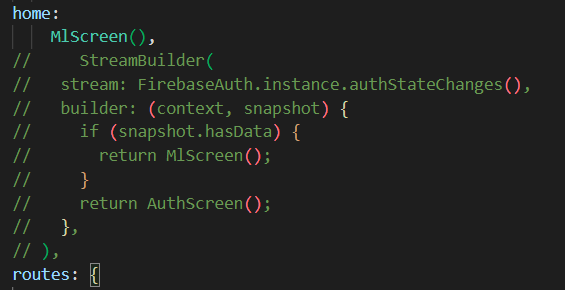

# Food Saver app

The Food Saver app is a machine learning mobile application made to help in reducing food wastage in households.

Machine learning model will identify left-over ingredients. Once the ingredients are recognised, a list of suggested recipes will be shown to help individuals in utilising their existing components. The app can also be used to help in-experience cooks to learn and look up recipes. Furthermore, the app can also be utilised during grocery shopping as individuals can decide on what to cook as well as buy only the necessary components they need. 

## Requirements
- Android emulator or android phone
- Firebase google account (optional)
- Firebase project (optional)

## Connecting to Firebase
To connect the application to your firebase project, please follow the instructions:
- Once a project is created, navigate to the **Project Overview**
- Click on the **Add app** button
- Fill and follow the instructions given

## Skip Authentication
To skip the authentication and directly go to the machine learning screen:
- Navigate to the **main.dart** file
- In the MaterialApp widget, navigate to the home section
- Comment out the StreamBuilder and Uncomment the *MLScreen* widget

## Running the code
- At the [github page](https://github.com/Denz1423/ML-mobileapp) either fork or download the zip file
- If fork, copy the project link URL
- In your chosen IDE terminal, type **Git Clone** and paste the project link URL
- Once the project is clonned or unzipped, connect your own firebase project or follow the skip authentication section above
- When the firebase project is setup or skipped, run ***Flutter Run*** on your terminal to install the dependencies

